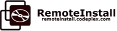

RemoteInstall is a VMWare-based tool to automate software testing, starting with software installation. It's a pragmatic approach to system and integration-testing starting with the installer process itself through the final installed product and product integration.

* [Screeshots](Screenshots/README.md)
* [Introducing Remote Install](http://www.slideshare.net/dblockdotorg/introducing-remote-install-framework)
* [Old Project on CodePlex](http://remoteinstall.codeplex.com/)

### Features

* Designed for continuous integration with CruiseControl and CruiseControl.NET.
* Supports VMWare Workstation, Player, Server and Virtual Infrastructure (ESX, etc.) with VMWare VIX 1.7.0+.
* Supports running multiple installers on multiple virtual machines with multiple snapshots.
* Command line, configuration file driven execution.
* XML and HTML logging with pretty xsl-tranformed output including custom merged results.
* Capable of executing user-defined command-line, virtual machine and virtual machine snapshot tasks.
* Capable of combining results from multiple runs and user-defined tasks.
* Automatically collects installation logs clickable in the results summary.
* Copies user-defined files and folders from/to the virtual machine.
* Supports horizontal scaling with parallel execution against multiple Virtual Machine hosts.
* Itegrates and remotes unit tests from unit test frameworks, including NUnit and JUnit.
* Supports some distributed test scenarios with multiple virtual machines and snapshots.

### Using RemoteInstall

* Download and Install [VMWare VIX API](http://www.vmware.com/support/developer/vix-api/).
* Download and Extract [RemoteInstall 1.2](http://code.dblock.org/downloads/remoteinstall/RemoteInstall.1.2.zip). 
* Open RemoteInstaller.chm and check out *Getting Started*.
