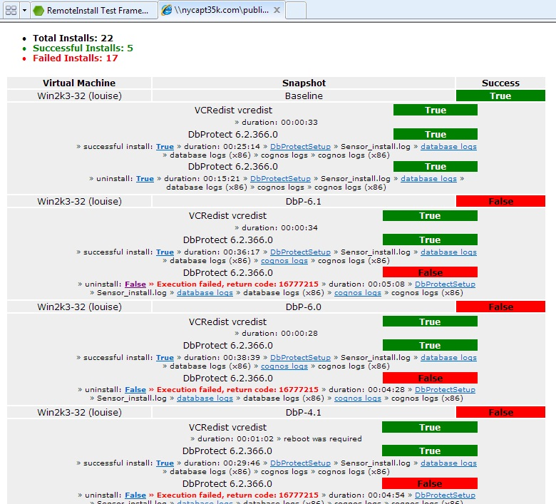
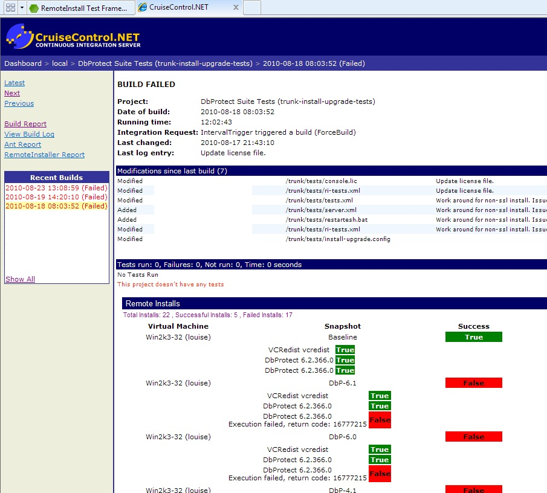
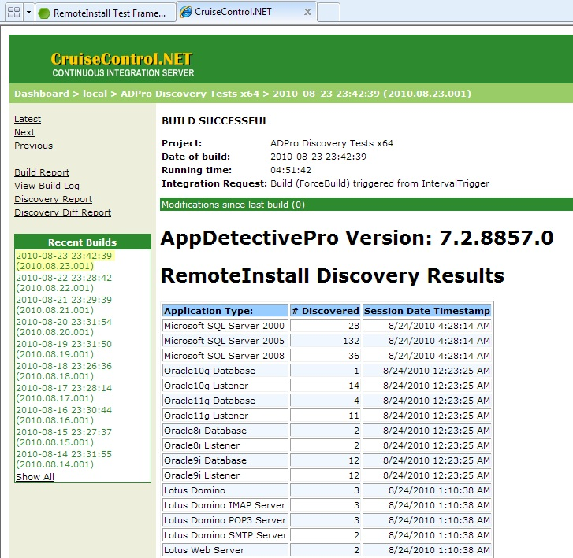
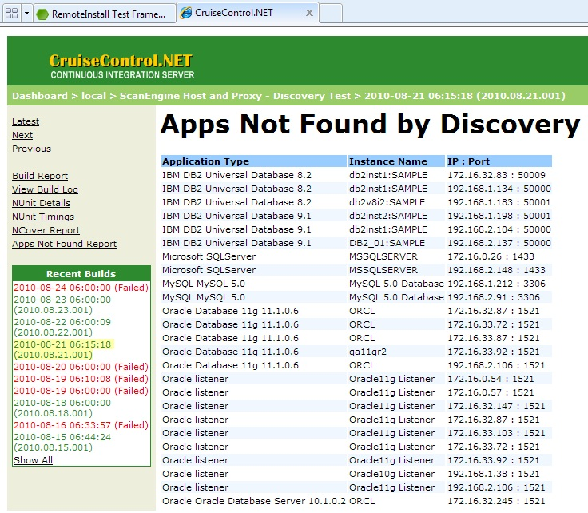
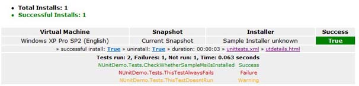

### Status Page

We run automated install/upgrade/uninstall tests for a suite of products - 3 bootstrapped installers total (about 18 MSIs). This produces the following XML document (rendered with XSLT) automatically. You can click on each link and get detailed logs from a success or failure as the system collects logs and organizes them in subfolders. This is the top of the page, there're a total of 22 installs in this test that span 4 virtual machine hosts. 5 scenarios have succeeded and 17 failed.

Since we introduced automated install/upgrade/uninstall tests we have had virtually no deployment failures with our customers!

### CruiseControl

The above status is summarized in CruiseControl. This is a less detailed view of the same information above.

### Remote Tests

We use RemoteInstall extensively to execute additional tests on various operating systems and do something more useful than just install. In the following screenshot we install a stable version of the product to run a network scan and count target systems of various types. These targets change a lot in our network, so we need new results every day. We run these tests daily with six different product configurations against six virtual machines, so RemoteInstaller is run 36 times every night for these tests.

We then run the next version of the product with code changes against the same targets and compare the results. In the following screenshot we find differences and thus can easily focus on a small number of regressions.

### NUnit

Similarly to the example above it's also possible to run other test systems after powering on a virtual machine and installing the software. XML results can be easily merged into the unified status. The following screenshot shows NUnit integration.

